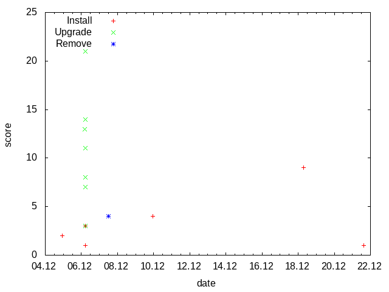

Examples
========

Create frequency graph from a log
---------------------------------

**Task:** Read /var/log/dpkg.log and create a graph to visualize how often packages are installed, upgraded and removed.

**Solution:** The loop (34) calls function *read_log* which reads the log line by line (13), splits the fields (14) and concatenate date *l[0]* and time *l[1]* in minutes (15). Third field of the log *l[2]* is status of the dpkg operation(install, upgrade, remove ...). Method *zincrby* (16) increments by 1 the score of *word* in the key *l[2]*. As a result the database contains keys(install, upgrade, remove ...) and associated lists of *words* sorted by score. Next loop (38) calls the function *write_csv* with all keys.  As a result *status.csv* files are created in the current directory with the *(date;score)* pairs.

`[create-graph-01.rb]
<https://github.com/vbotka/redis-rb-examples/blob/master/docs/source/code/create-graph-01.rb>`_

.. highlight:: Ruby
    :linenothreshold: 5                                                                     

.. literalinclude:: code/create-graph-01.rb
    :language: Ruby
    :emphasize-lines: 16, 24, 31, 38
    :linenos:

**Result:** The *status.csv* files can be used to create a graph with *gnuplot*.

`[create-graph-01.gnuplot]
<https://github.com/vbotka/redis-rb-examples/blob/master/docs/source/code/create-graph-01.gnuplot>`_

List 10 most used words in a text
---------------------------------

**Task:** Read text from a file and list 10 most frequently used words in it.

**Solution:** Let's use article about Redis at wikipedia.org as a text.

`[create-topchart-text.bash]
<https://github.com/vbotka/redis-rb-examples/blob/master/docs/source/code/create-topchart-text.bash>`_

.. literalinclude:: code/create-topchart-text.bash
    :language: Bash

*zincrby* (12) increments by 1 the score of *word* in the key *topchart* and *zrange* (14) returns top 10 words with scores.

`[create-topchart.rb]
<https://github.com/vbotka/redis-rb-examples/blob/master/docs/source/code/create-topchart.rb>`_

.. literalinclude:: code/create-topchart.rb
    :language: Ruby
    :emphasize-lines: 8, 12, 14
    :linenos:

**Result:**

.. code-block:: bash

  > ./create-topchart.rb
  11.0 Retrieved
  13.0 edit
  23.0 in
  24.0 a
  24.0 is
  26.0 and
  33.0 of
  34.0 to
  37.0 the
  69.0 Redis
